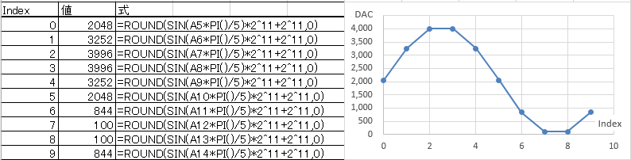
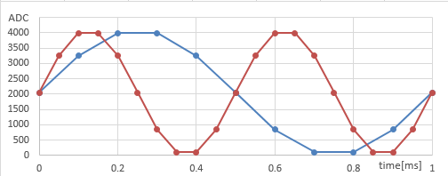
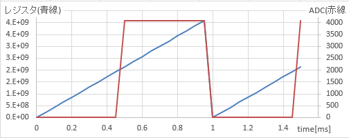

# タイマー[^1]の構成

## PWMを使う場合

HALのAPIを使って、好きな周波数の矩形波を発生させることができる。

## DACを使う場合1

サイン波を10分割したテーブルを用意し、10kHzのタイマー割り込みで1つづつDAC出力する。すぐにわかるように、これは1kHzのサイン波(の近似)を出力する。20kHzの割り込みでテーブルを送れば2kHzの出力だ。




この方式は非常に明快だし、テーブルを変えれば任意の波形を発生することができる。欠点は次の2つ。

* 波形のぶん、テーブルの容量が必要。
* ひとつの音しか出せない(モノフォニック)。

最近のシンセサイザーは富豪的にこの方法を用いているが、組み込み分野では制約も大きい。

## DACを使う場合2

そこで NCO という方法が使われる。タイマーは20kHz一定で割り込みを掛ける。1kHzの出力を得たいときには、割り込みルーチンでは 32bitレジスタに 2^32 /(1k/20k)=214748365 づつ足しこむ。そうすると、20回足しこむ毎にオーバーフローで 0 に戻る。最上位ビットが 1 のときに 2^12 -1 を 0 の時に 0 を DAC から出力すれば、矩形波が得られる。

2kHzの出力を得たいときには 2^32 /(2k/20k)=42949672960、0.5kHzの出力を得たいときには 2^32 /(2k/20k)=171798691840 を足しこめばよい。


元になるレジスタの値は三角波的に変化しているので、最上位ビットを取れば矩形波になるし、正弦波が欲しければ二次関数で近似すればかなり良い近似が得られる。警報音としては高調波が求められるので、矩形波ベースの出力が良いだろう。




特徴は次の2つ。

* テーブル不要。
* 足しこむ数を変えれば、タイマ周期は一定でも複数の周波数を発生できる(ポリフォニック)。

ふたつ目の特徴とフーリエ級数を組み合わせて音色を作ることもできる。とくに、高調波の要求を満たすためには役に立つだろう。不協和音も生成可能だ。

NCOとはNumerical Control Oscilator の略である。もともと、アナログシンセサイザーの時代に、VCO(Voltage Control Oscilator)という電圧で周波数を変化させることができる発信機を使っていた。
デジタル時代になって、それを数値化したものがNCOである。入力する数値(レジスタに足しこむ値)によって発振周波数が変わる。


## 多項式近似

三角波から正弦波に変換する方法には、多項式近似やCORDICといった方法がある。

多項式近似は簡単。CORDICは、正弦と余弦を同時に求めたい場合や、繰り返し演算によって精度を高めたい場合に適する。

ここではマクローリン展開による多項式近似について説明しよう。

マクローリン展開とは、簡単に言うと、x=0におけるべき級数展開だ。

つまり、f(x)=a_0 x^0 + a_1 x^1 + a_2 x^2 + a_3 x^3 + a_4 x^4 + a_5 x^5 + a_6 x^6 + …

ここで、e^x のテイラー展開が次であることを知っておこう。微分を繰り返せば理解できると思う。

e^x = 1 + x^1 / 1! + x^2 / 2! + x^3 / 3! + x^4 / 4! + x^5 / 5! + x^6 / 6! + x^7 / 7! + …

ここで、x に jx を代入し、オイラーの公式を使うと次のようになる。

e^jx = cos x + j sin x = 1 + j x^1 / 1! - x^2 / 2! - j x^3 / 3! + x^4 / 4! + j x^5 / 5! - x^6 / 6! - j x^7 / 7! + …

虚数部と実数部をそれぞれ対応させることによって、

cos x = 1 - x^2 / 2! + x^4 / 4! - x^6 / 6! + …

sin x = x^1 / 1! - x^3 / 3! + x^5 / 5! - x^7 / 7! + …

x に、0～2^32 が0～2πになるように適切にスケーリングした三角波の値を入力すれば、それぞれ、正弦波、余弦波が得られる。

しかし、sin と cos は並行移動であることを考えると、演算量を節約するためには cos x ≒ 1 - x^2 / 2 を使う方が、sin x ≒ x - x^3 / 6 を使うよりも望ましい。さらに言うと、0 ～π/4 の区間では sin x ≒ x の近時で精度が出る。

擬似コードで書くと、次のような感じになるはずだ。

```
// phase は32ビット符号無し整数だが、
// 以下のx は適切にスケーリングされた符号つき数であることに注意。
int ty_sin(int x)
{
    if (x < π/4) {
        return x;     // sin x = x
    } else if (x < π*(3/4) {
        y = π/2 - x; // 反転
        return 1 - y^2 / 2; // cos x = 1-x^2/2
    } else if (x < π*(5/4)) {
        y = π - x;
        return -y;
    } else if (x < π*(7/4))
        y = π*(3/2) - x;
        return -(1 - y^2 / 2);
    } else {  // x < 2*π
        return x
    }
}
```


[^1]: そう言えば、むかし、忌野清志郎によく似ている人物が「ザ・タイマーズ」というバンドをやっていた。